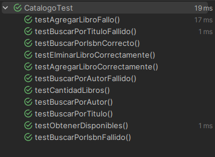
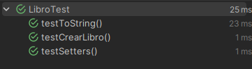
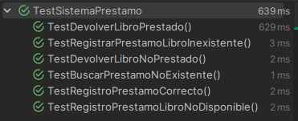
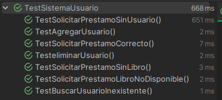

# Uso de IA

En general, la inteligencia artificial se utilizó como un **tutor** para verificar si el enfoque de los tests era correcto, y también para profundizar en el uso de las librerías `JUnit5` y `Mockito`.

En algunos casos (específicamente en los tests del método `solicitarPrestamo` de la clase `SistemaUsuarios`), se implementaron líneas de código generadas con ayuda de la IA. Por ejemplo:

```java
@Test
public void TestSolicitarPrestamoLibroNoDisponible() {
    Libro libro = new Libro("123-4-56-789101-1", "Refactoring", "Pedro", EstadoLibro.PRESTADO);
    Usuario usuario = new Usuario("usuario");

    when(catalogo.buscarPorISBN("123-4-56-789101-1")).thenReturn(libro);
    
    // Línea generada con IA
    doThrow(new PrestamoExepcion("El libro ya se encuentra prestado"))
        .when(sistemaPrestamos).registrarPrestamo("123-4-56-789101-1");

    sistemaUsuarios.agregarUsuario(usuario);

    // Línea generada con IA
    UsuarioExepcion exepcion = assertThrows(
        UsuarioExepcion.class, 
        () -> sistemaUsuarios.solicitarPrestamo("usuario", "123-4-56-789101-1")
    );

    // Línea generada con IA
    assertEquals("Error al registrar prestamo: El libro ya se encuentra prestado", exepcion.getMessage());

    verify(sistemaPrestamos).registrarPrestamo("123-4-56-789101-1");
}
```
Este tipo de asistencia permitió validar excepciones específicas, 
mejorar la cobertura de casos límite y asegurar el comportamiento esperado del sistema frente a errores.

---

# EVidencia

## Tests de `catalogo`

<p align="left">
  
</p>

---

## Tests de `Libro`

<p align="left">
  
</p>

---

## Tests de `sistemaPrestamo`

<p align="left">
  
</p>

---

## Test de `sistemaUsuario`

<p align="left">
  
</p>

---

